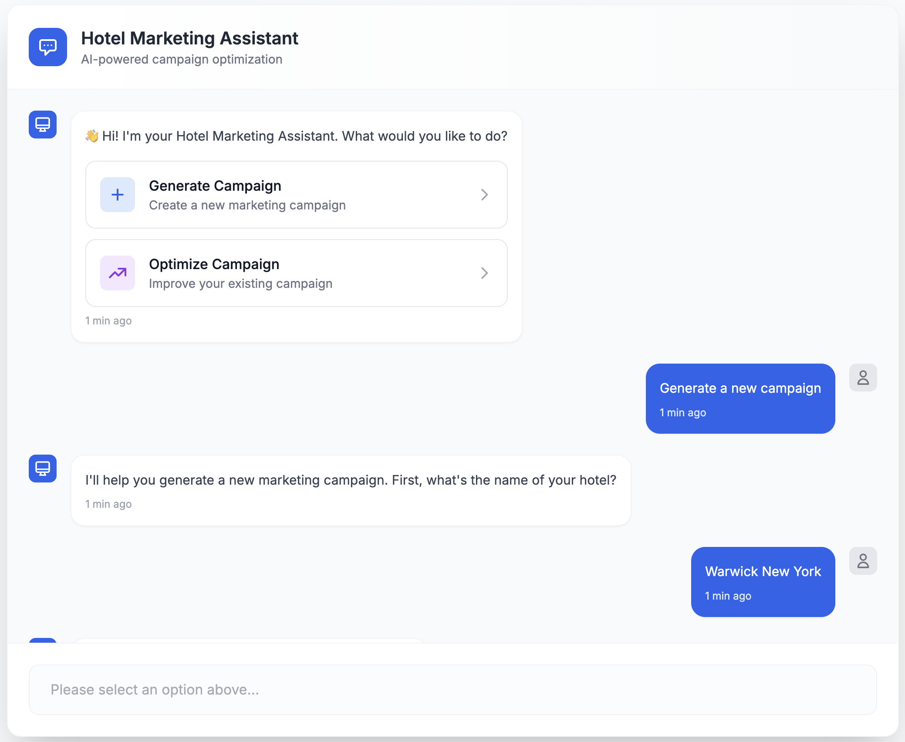
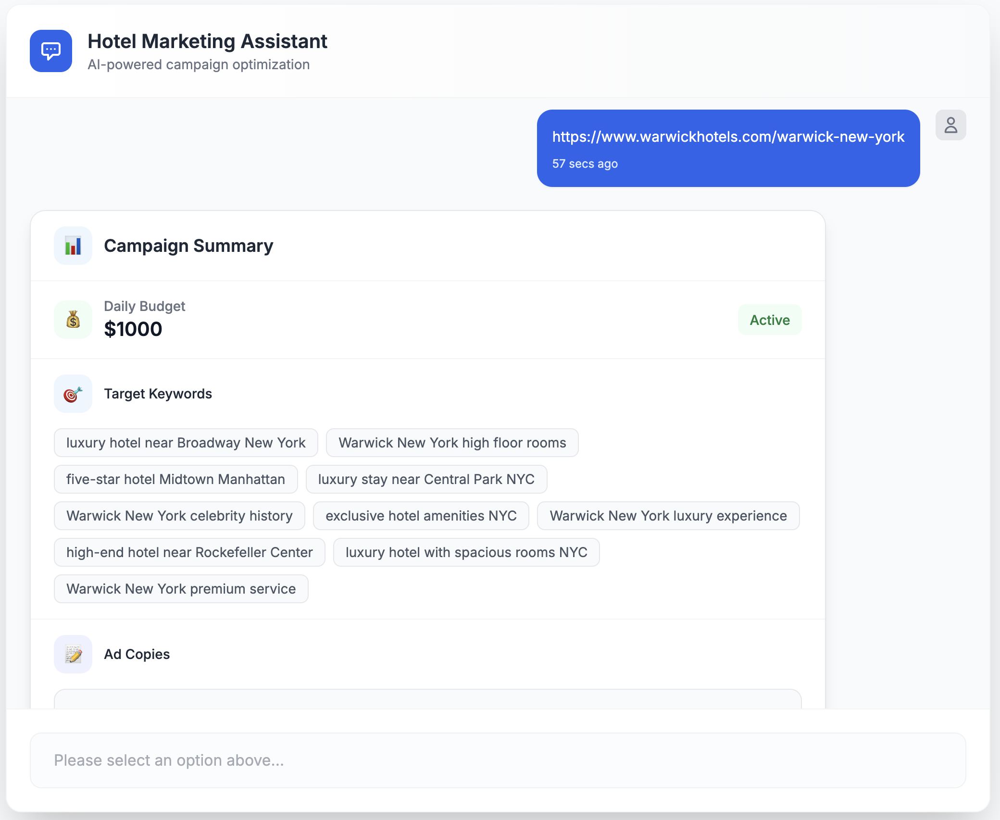
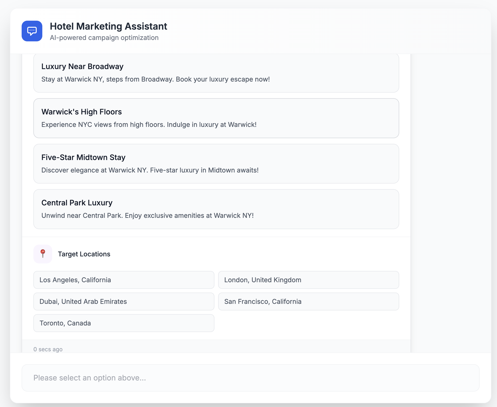
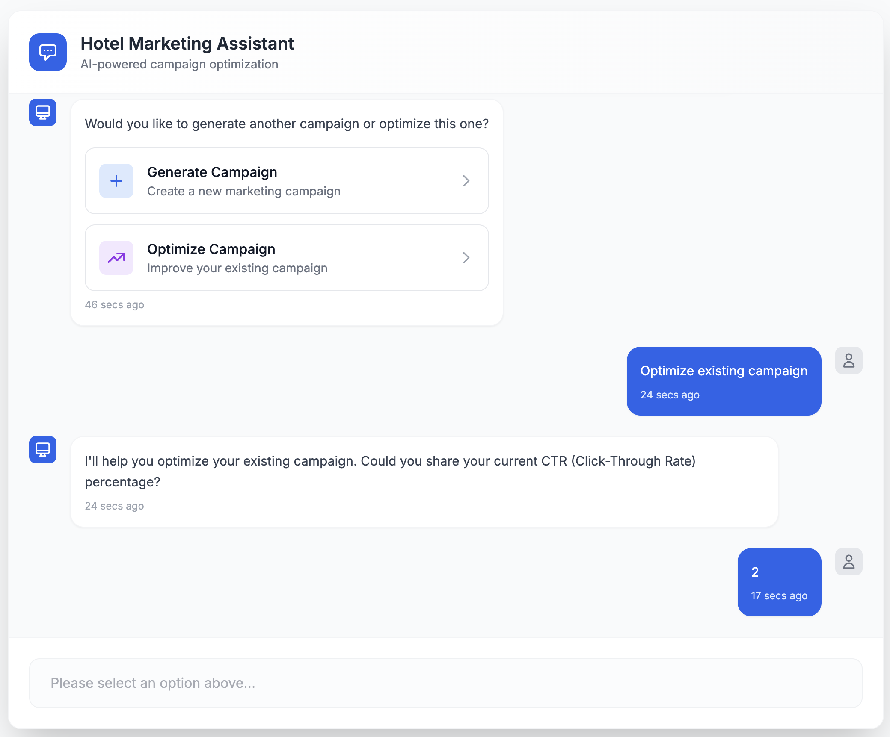
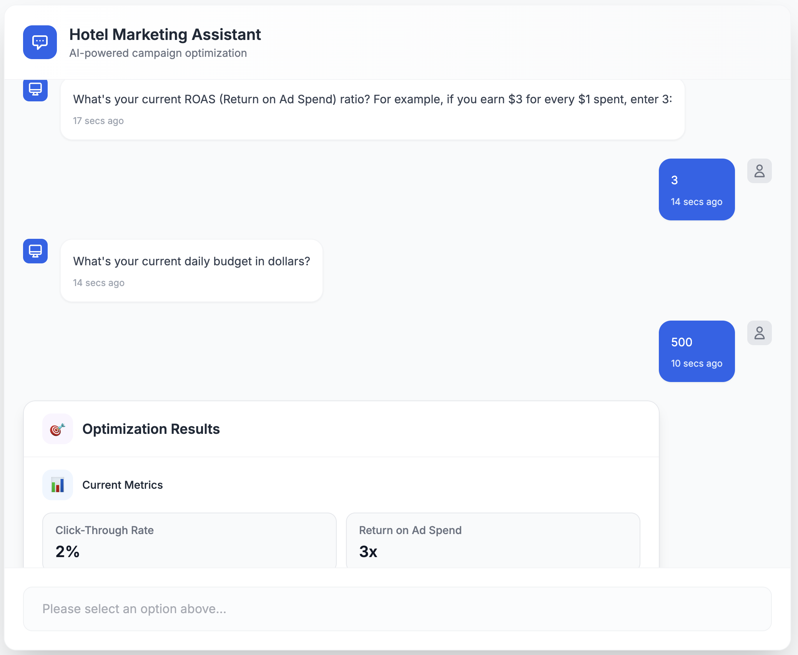
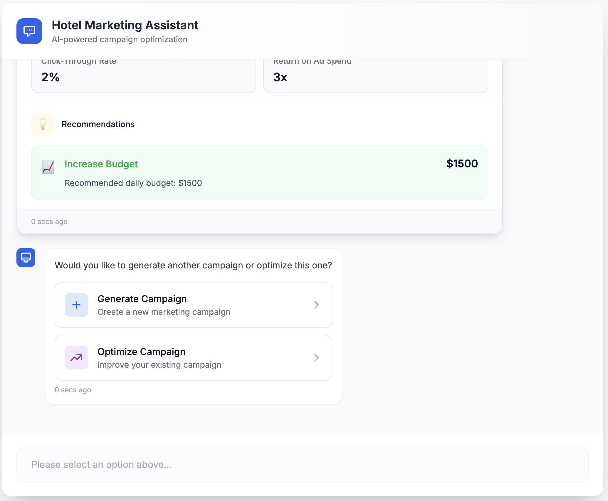

# Hotel Marketing Campaign Generator

An AI-powered tool that generates optimized marketing campaigns for hotels using LangGraph.js and Next.js.

## Preview

Here's a visual walkthrough of the application:

### 1. Landing Page


### 2. Campaign Form


### 3. Generation Process


### 4. Campaign Results


### 5. Optimization Options


### 6. Final Dashboard


## Project Structure

- `backend/` - Express.js backend with LangGraph.js implementation
- `hotel-marketing-ui/` - Next.js frontend with Tailwind CSS

## Setup Instructions

### Backend Setup

1. Navigate to the backend directory:
   ```bash
   cd backend
   ```

2. Install dependencies:
   ```bash
   npm install
   ```

3. Create a `.env` file and add your API keys:
   ```
   OPENAI_API_KEY=your_openai_api_key
   TAVILY_API_KEY=your_tavily_api_key
   LANGSMITH_API_KEY=your_langsmith_api_key
   ```

### Frontend Setup

1. Navigate to the frontend directory:
   ```bash
   cd hotel-marketing-ui
   ```

2. Install dependencies:
   ```bash
   npm install
   ```

## Running the Application

### Backend
```bash
cd backend
npm run dev
```

### Frontend
```bash
cd hotel-marketing-ui
npm run dev
```

The frontend will be available at `http://localhost:3000` and the backend at `http://localhost:3001`. 